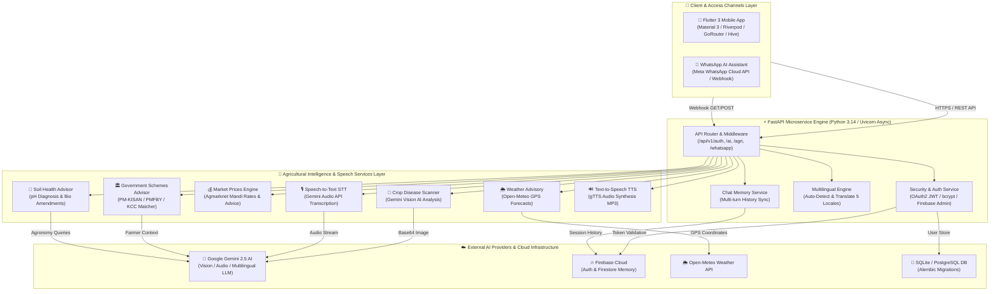

# 🏗️ Agrolith-AI — System Architecture & Technical Specification

This document provides a comprehensive technical overview and architectural blueprint for **Agrolith-AI**.

---

## 🎨 System Architecture Diagram (SVG Visual)

---

## 📊 System Architecture Diagram (Mermaid Definition)

---

## 🧱 Component Breakdown

### 1. 📱 Flutter 3 Mobile App
- **UI Framework**: Material 3 design system with dynamic light/dark green color palettes.
- **State Management**: `flutter_riverpod` for reactive, decoupled state injection.
- **Routing**: `go_router` with location-synced bottom navigation and authentication redirects.
- **Networking & Resilience**: `DioApiClient` with 15s connection timeouts and 3x exponential backoff retries.
- **Offline Caching**: `hive` for persistent offline storage of weather data, chat sessions, and user settings.

### 2. 💬 Meta WhatsApp Cloud API Bot
- **Webhook Receiver**: `GET /api/v1/whatsapp/webhook` handles automatic Meta challenge verification.
- **Async Event Handler**: `POST /api/v1/whatsapp/webhook` uses FastAPI `BackgroundTasks` to guarantee response times under **< 3 seconds**.
- **Multi-Modal Support**: Receives incoming Text queries, Crop Photos, Voice Notes, and Soil Test PDF documents.

### 3. ⚡ FastAPI Microservice Engine
- **Asynchronous Execution**: Powered by Uvicorn and Python 3.14 async event loops.
- **Structured Middleware**: Performance timing logger and Pydantic schema validation handlers.
- **Security**: OAuth2 Bearer JWT tokens, bcrypt password hashing, and Firebase Admin SDK credentials.

### 4. 🤖 Google Gemini 2.5 AI & Multilingual Engine
- **Gemini 2.5 Flash**: Multilingual LLM for organic agricultural advisory.
- **Gemini Vision**: High-accuracy plant pathology diagnosis from leaf images.
- **Gemini Audio STT**: Speech-to-text conversion for voice queries in Indian regional accents.

### 5. 🌦️ Weather, Market Prices, Schemes & Soil Services
- **Weather Advisory**: Queries Open-Meteo API using farmer GPS coordinates to generate spray and harvest advisories.
- **Mandi Market Prices**: Real-time mandi rates, price trend indicators (Rising/Falling/Stable), and selling window advice.
- **Government Schemes**: Matches farmers against PM-KISAN, PMFBY, KCC, PKVY, and state subsidies with direct website links.
- **Soil Health Advisor**: Interactive pH scale diagnosis (0–14), deficiency identification, and organic amendment plans.
